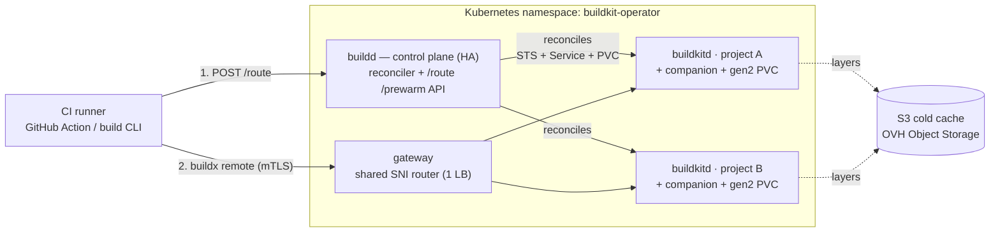
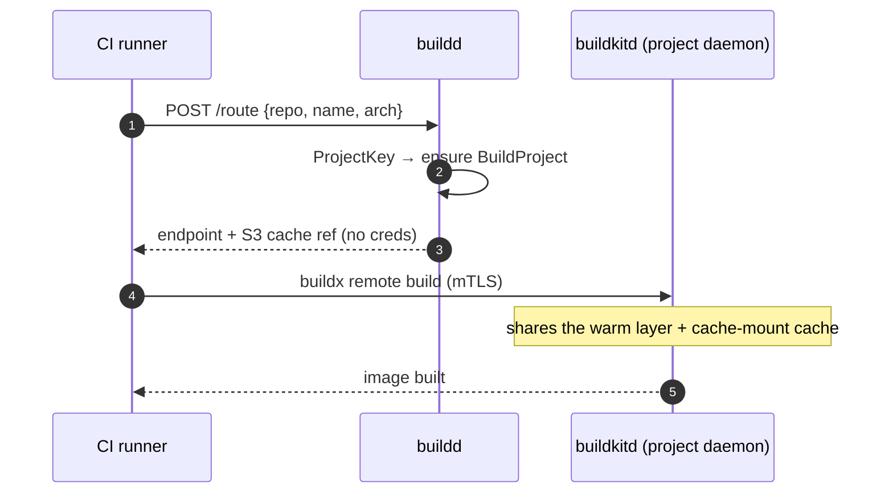
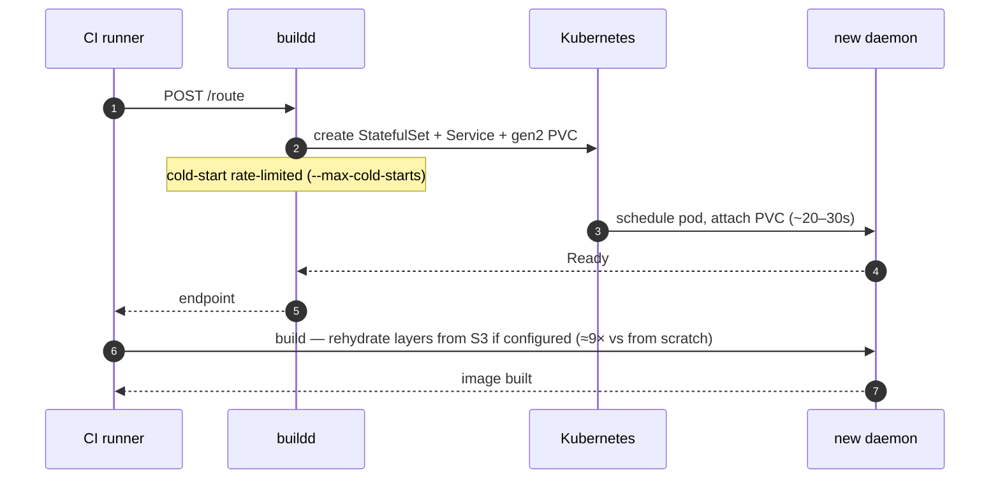
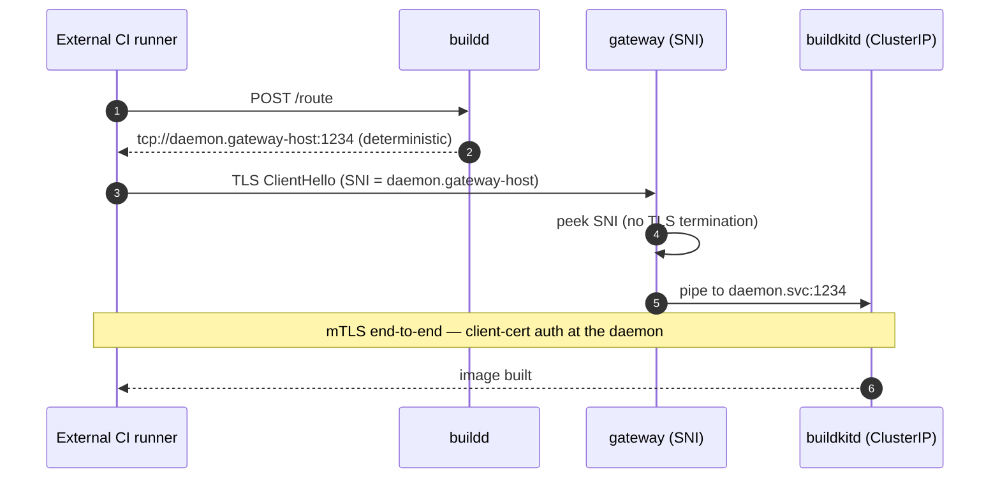
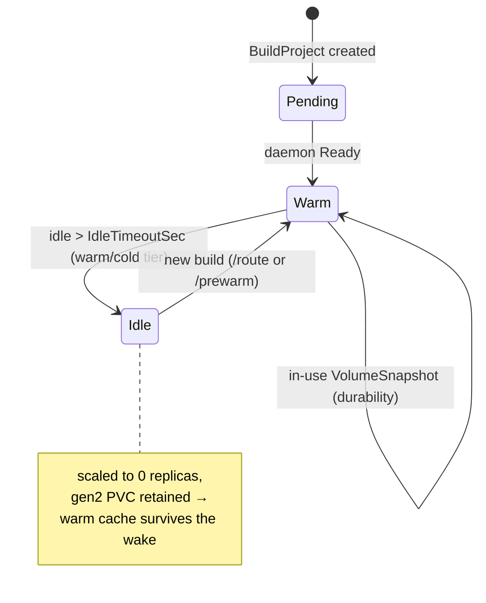

# buildkit-operator

**A distributed BuildKit build service: one hot, *vanilla* `buildkitd` per `(project, arch)` on Kubernetes.**

buildkit-operator gives CI image builds the perceived speed of a warm local BuildKit cache, with the
elasticity and durability of Kubernetes — **without forking BuildKit, containerd, or writing a
custom snapshotter.** It is a small **control plane** (routing + lifecycle) on top of stock
`buildkitd`/`containerd`. Built for OVH Managed Kubernetes (Cinder gen2), portable to any CSI.

The numbers below are measured on a real OVH MKS cluster: **warm builds ≈ 10 s** (vs ≈ 18 s on a
shared pool), a **cold daemon rehydrates ≈ 9× faster** from S3 (4.5 s vs 41.8 s), and idle projects
**scale to zero** while keeping their cache. buildkitd stays unmodified.

---

## Features

- 🚀 **Warm dedicated cache** — a hot `buildkitd` per project shares layers **and** `RUN --mount=type=cache` mounts, with no noisy neighbours. [architecture →](docs/architecture.md)
- ❄️ **Scale-to-zero** — idle projects drop to 0 replicas while the gen2 PVC is **retained**, so waking up is an attach, not a rebuild. [storage →](docs/storage-and-cold-cache.md)
- ♻️ **S3 cold cache** — a fresh or wiped daemon rehydrates layers from S3, **≈ 9× faster** than building from scratch. External and opt-in. [cold cache →](docs/storage-and-cold-cache.md)
- 💾 **Durable snapshots** — periodic **in-use** `VolumeSnapshot`s let a project's cache survive the PVC, the pod, and the cluster (DR / migration). [storage →](docs/storage-and-cold-cache.md)
- 🛡️ **Fork-PR isolation** — untrusted builds get an ephemeral daemon seeded **read-only**, with no write-back: anti cache-poisoning by construction. [security →](docs/security.md)
- 🔀 **Monorepo-aware routing** — an optional component name segments one repo into per-image daemons + caches, so unrelated components never thrash a shared cache. [architecture →](docs/architecture.md)
- 🌐 **One shared SNI gateway** — a single LoadBalancer fronts every daemon by SNI; **mTLS stays end-to-end** (the gateway terminates no TLS), instead of a public LB per daemon. [gateway →](docs/architecture.md#the-shared-sni-gateway-off-cluster-ci)
- 📈 **Prometheus observability** — routes, route latency, cold-starts in flight, scale events, snapshots. [operations →](docs/operations.md#observe)
- 🔌 **Zero-config CI** — drop in the [GitHub Action](#quick-start) and you are building; any CI that runs `docker buildx` works the same. [CI integration →](docs/ci-integration.md)
- 🔒 **Vanilla rootless buildkit** — no fork of BuildKit, containerd, or the snapshotter; the daemon runs non-root and unprivileged. [security →](docs/security.md)
- 🧱 **HA control plane** — `buildd` runs 2 replicas with leader election; routing is served by every replica. [architecture →](docs/architecture.md#control-plane-ha)

All numbers are validated on OVH Managed Kubernetes (GRA9, Cinder gen2). See
[performance.md](docs/performance.md) for the methodology.

---

## Why this design

The core insight: **concurrency and cache sharing are free if they stay inside a single
daemon.** A `buildkitd` instance has one local store (content + snapshots + bbolt metadata), so:

- two concurrent builds of the same project **share layers _and_ `RUN --mount=type=cache`
  cache mounts**, and **dedup in-flight** — for free, internally;
- buildkit-operator never touches the storage layer. It attacks **routing** (send builds that should
  share a cache to the *same* daemon) and **lifecycle** (keep it warm, scale it to zero, snapshot
  it, clone it).

This holds against the BuildKit source: cache mounts are keyed by mount id (not build/session id) in
a daemon-wide pool, and identical solves merge in the scheduler. So the value add is **good
Kubernetes orchestration + the stock BuildKit client**, not low-level systems code.

---

## Architecture



**Routing rule (critical):** all builds that must share a cache **must resolve to the same key**
⇒ the same StatefulSet ⇒ the same daemon. The key is `"p" + sha256(normRepo [⏎ n:name] ⏎
normTarget ⏎ normArch)[:16]` — coarse on purpose (no context, no branch) so concurrent and later
builds converge. A too-fine key fragments the cache and kills sharing. The optional `name` segments
a **monorepo** into per-component daemons (one daemon + cache per image); an **empty** `name` is
omitted from the hash, so single-image repos keep the exact same key (migration-safe).

---

## How it works (flows)

**Warm build** — the common path: the project's daemon is already up, so the build hits a hot cache.



**Cold start** — first build of a project (or after the cache was lost): buildd provisions a daemon,
rate-limited so a CI burst can't stampede the Cinder attaches.



**Off-cluster CI via the gateway** — one shared SNI router fronts every daemon; mTLS stays
end-to-end (the gateway never decrypts).



**Daemon lifecycle** — tier-aware scale-to-zero with the PVC retained, plus in-use durability
snapshots.



---

## Quick start

Use the GitHub Action — route, mTLS, warm cache, and the S3 cold cache are all wired for you:

```yaml
- uses: socialgouv/buildkit-operator@v1
  with:
    buildd-url: ${{ vars.BUILDKIT_OPERATOR_BUILDD_URL }}
    ca: ${{ secrets.BUILDKIT_OPERATOR_CA }}
    cert: ${{ secrets.BUILDKIT_OPERATOR_CERT }}
    key: ${{ secrets.BUILDKIT_OPERATOR_KEY }}
    tags: ghcr.io/org/app:${{ github.sha }}
    push: "true"
```

The Action defaults `repo` to the GitHub repository (your cache key); set `name` for a monorepo
component, `arch`, `file`, `target`, or `context` as needed. The cold cache needs **no** client
config — it is a buildd-side policy, returned by `/route` and applied automatically.

**Any CI works.** The Action wraps `scripts/build.sh`, a CI-agnostic POSIX script (route → `buildx
remote` over mTLS) that runs unchanged on a GitLab runner, Jenkins, or a laptop. See
[ci-integration.md](docs/ci-integration.md).

You can also drive the control plane directly:

```bash
# build via the CLI (resolves the key, routes through buildd, builds via buildx remote+mTLS)
build --repo github.com/acme/app --arch amd64 -t registry/acme/app:sha --push .

# monorepo: --name (env BUILDKIT_OPERATOR_NAME) segments one repo into per-component daemons + caches
build --repo github.com/acme/monorepo --name api --arch amd64 -t registry/acme/api:sha --push .

# or just talk to the buildd API
curl -XPOST http://buildkit-operator-buildd.buildkit-operator.svc:8080/route   -d '{"repo":"github.com/acme/app","arch":"amd64"}'
curl -XPOST http://buildkit-operator-buildd.buildkit-operator.svc:8080/prewarm -d '{"repo":"github.com/acme/app","arch":"amd64"}'   # on git push
curl -XPOST http://buildkit-operator-buildd.buildkit-operator.svc:8080/route   -d '{"repo":"...","arch":"amd64","untrusted":true}'   # fork PR -> isolated daemon
```

`buildd` HTTP API: `POST /route` (ensure + wait Ready, returns the mTLS endpoint + optional cache
reference), `POST /prewarm` (anticipatory scale-up, returns immediately), `GET /healthz`, and
Prometheus on `--metrics-addr` (`:8081`).

---

## Install

Prerequisites: a Kubernetes cluster with a CSI that supports snapshots (OVH MKS gen2 +
`csi-cinder-snapclass-in-use-v1`), `kubectl`, `helm`, and the VolumeSnapshot CRDs.

```bash
# 1. CRDs
make manifests && kubectl apply -f deploy/crd

# 2. mTLS certs (wildcard SAN over the daemon Services)
deploy/cert/create-certs.sh buildkit-operator
kubectl -n buildkit-operator apply -f deploy/cert/.certs/*-secret.yaml

# 3. control plane (buildd Deployment + RBAC + buildkitd.toml ConfigMap)
helm upgrade --install buildkit-operator deploy/helm/buildkit-operator -n buildkit-operator --create-namespace
```

The full runbook — public exposure, the Kyverno exemption, HA, the S3 cold cache, and teardown — is
in [operations.md](docs/operations.md).

> **Admission policy note.** Rootless `buildkitd` requires `allowPrivilegeEscalation` **unset** (its
> `newuidmap` needs `no_new_privs` OFF); the pods stay non-root and unprivileged. A policy that
> *forces* `allowPrivilegeEscalation: false` (e.g. Kyverno) crash-loops the daemon — exempt the
> daemon namespace. See [security.md](docs/security.md#admission-policy-kyverno--restricted-pss).

---

## The `BuildProject` resource

```yaml
apiVersion: buildkit-operator.socialgouv.github.io/v1alpha1
kind: BuildProject
metadata:
  name: p1a2b3c4d5e6f7a8        # = spec.key
  namespace: buildkit-operator
spec:
  key: p1a2b3c4d5e6f7a8         # stable cache identity (set by the router)
  repo: github.com/acme/app     # normalized, informational
  name: ""                      # optional monorepo component ("" => whole repo; segments the cache)
  target: ""                    # Dockerfile target stage ("" => default)
  arch: amd64                   # amd64 | arm64
  tier: warm                    # hot (never scale-to-zero) | warm | cold
  idleTimeoutSec: 900           # wake window before scale-to-zero
  cacheVolumeGi: 60             # gen2: throughput scales with size
  storageClass: csi-cinder-high-speed-gen2
  snapshotEverySec: 0           # durability snapshot cadence (0 = off)
  restoreFromSnapshot: ""       # seed the cache PVC from a VolumeSnapshot (DR / new cluster)
  fanout: 0                     # extra CoW clone daemons for a saturated project (0 = none)
  securityProfile: rootless     # rootless | userns | privileged
status:
  phase: Warm                   # Pending | Warm | Idle | Scaling | Failed
  replicas: 1
  endpoint: tcp://buildkitd-p1a2b3c4d5e6f7a8.buildkit-operator.svc:1234
  lastSnapshot: snap-...
```

You rarely write these by hand — the GitHub Action / `build` CLI / `buildd` `/route` create them on
demand.

---

## Documentation

This README is the overview. The [`docs/`](docs/) directory holds the deep-dives and the measured
evidence from validating buildkit-operator on a real OVH MKS cluster:

- [architecture.md](docs/architecture.md) — routing key, reconcile loop, HA, the shared SNI gateway
- [security.md](docs/security.md) — rootless constraint, Kyverno fix, threat model, fork isolation
- [storage-and-cold-cache.md](docs/storage-and-cold-cache.md) — the 3 cache layers; **S3 ≈ 9× cold**
- [performance.md](docs/performance.md) — measured warm/cold, with/without S3
- [comparison-buildkit-service.md](docs/comparison-buildkit-service.md) — side-by-side vs the shared service
- [ci-integration.md](docs/ci-integration.md) — the GitHub Action, CI-agnostic core, public exposure
- [benchmarks-phase0.md](docs/benchmarks-phase0.md) — the Cinder gen2 bench that picks the config
- [operations.md](docs/operations.md) — deploy / expose / observe / tear down runbook

---

## License

[MIT](LICENSE) © SocialGouv.

> Scope note: buildkit-operator shares **layers** across daemons (via S3) but never merges bbolt
> stores or shares a writable cache *between* daemons — that does not exist in BuildKit. Cache mounts
> stay per-daemon by design.
