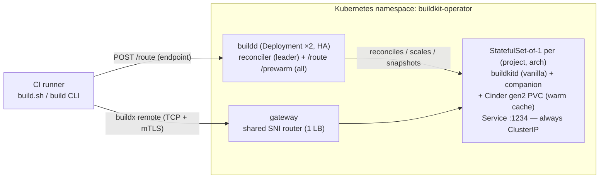

# Architecture

buildkit-operator is a **control plane** over stock `buildkitd`. It owns two things — **routing** (send
builds that should share a cache to the same daemon) and **lifecycle** (keep that daemon warm,
scale it to zero, snapshot it, clone it). It deliberately owns **nothing** at the storage layer:
the daemon's content store, snapshots, and bbolt metadata are vanilla.

## The routing key — the one invariant that matters

All builds that must share a cache **must resolve to the same key** ⇒ the same `StatefulSet` ⇒ the
same daemon. This is the heart of the design and lives in [`internal/router`](../internal/router)
as a **pure function**, shared verbatim by the CLI and the control plane so they can never disagree.

| Function | Formula | Purpose |
|---|---|---|
| `ProjectKey(repo, name, target, arch)` | `"p" + sha256(normRepo [\x00 n:name] \x00 normTarget \x00 normArch)[:16]` | the canonical cache identity |
| `ForkKey(canonicalKey)` | `"fork" + key` | an **ephemeral, isolated** daemon for untrusted/fork PRs |
| `CloneKey(canonicalKey, i)` | `"c" + i + key` | the i-th **CoW clone** for fan-out (M5) |
| `CachePVCName(key)` | `"cache-buildkitd-" + key + "-0"` | the StatefulSet's `volumeClaimTemplate` PVC |
| `EndpointHost(host, port)` | `tcp://host:port` | the deterministic `<daemon>.<gateway-host>` endpoint for off-cluster CI via the shared SNI gateway |

Design points proven out in this session:

- **The key is coarse on purpose** — no branch, no commit, no build context. Two concurrent builds
  and a build an hour later all converge to the same daemon, so they share layers and cache mounts.
  A finer key (e.g. per-branch) would fragment the cache and defeat the whole point.
- **`target` is part of the key** because different Dockerfile target stages have genuinely
  different caches; folding them together would thrash.
- **`arch` is part of the key** because a daemon is single-arch (it builds natively; cross-arch is a
  separate daemon, not QEMU-in-one).
- **The optional `name` segments a monorepo** into per-component daemons — one daemon + cache per
  image, so unrelated components in the same repo don't share (or thrash) a cache. It is **omitted
  from the hash when empty**, so a single-image repo keeps the exact key it had before `name`
  existed (migration-safe). Wired end-to-end through `RouteRequest.Name`, `BuildProjectSpec.Name`,
  `DeriveChild`, and the CLI `--name` flag (env `BUILDKIT_OPERATOR_NAME`) / `build.sh NAME`.

Example: `SocialGouv/buildkit-operator-example` + `amd64` (empty name) → `pa081c22c974da132` (the daemon name
you see running on the cluster).

## The reconcile loop

The `BuildProject` reconciler ([`internal/controller`](../internal/controller)) is a standard
controller-runtime loop. Per object it converges:

1. **StatefulSet-of-1 + Service + PVC** — rendered by [`internal/builder`](../internal/builder) with
   the rootless security profile and the gen2 `volumeClaimTemplate`. The Service is the stable mTLS
   endpoint `:1234`.
2. **`desiredReplicas`** — tier- and idle-aware **scale-to-zero** (M2). When a `warm`/`cold` project
   goes idle past `idleTimeoutSec`, it scales the StatefulSet to 0 **but keeps the PVC** — so waking
   up is an attach, not a restore. `hot` never scales to zero.
3. **`maybeSnapshot`** — periodic **in-use** `VolumeSnapshot` (M3) on the `snapshotEverySec`
   cadence, using OVH's in-use snapclass so the daemon does **not** need to scale to zero to be
   snapshotted. Old snapshots are pruned to `--keep-snapshots`.
4. **`reconcileFanout`** — when `spec.fanout > 0` (M5), materializes N **CoW clone** daemons
   (`CloneKey`) from the latest snapshot — vertical-first scaling for a saturated project. The clone
   spec comes from the **shared derivation policy** `buildkit-operatorv1.DeriveChild(parent, parentSnapshot,
   CloneChild, key)` — the *same* function the `/route` fork path uses (with `ForkChild`), so a
   fan-out clone and a fork daemon can never drift in how they inherit storage/security and seed
   from the parent snapshot.
5. **Status** — `phase` (Pending/Warm/Idle/Scaling/Failed), `replicas`, `endpoint`, `lastSnapshot`.
   Status is only written when it actually changes (a busy-loop guard learned the hard way —
   unconditional status writes re-trigger reconcile forever).

Metrics emitted: `buildkit_operator_routes_total`, `buildkit_operator_route_duration_seconds`,
`buildkit_operator_coldstarts_inflight`, `buildkit_operator_scale_events_total`, `buildkit_operator_snapshots_total`.

## Control-plane HA

`buildd` runs `replicas: 2` with **leader election** (`--leader-elect`, a `coordination.k8s.io`
Lease). Two roles, split deliberately:

- **The reconciler runs on the leader only** — exactly one writer of cluster state, no double
  reconcile.
- **The `/route` HTTP API runs on every replica** — the route server sets
  `NeedLeaderElection() = false`, so a routing request is served whether it lands on the leader or a
  follower. Routing is read-mostly (ensure-or-wait); only the leader mutates.

Verified live: `buildkit-operator-buildd` reports `2/2` ready and the `buildkit-operator-buildd.buildkit-operator.socialgouv.github.io` Lease is
held by one of the two pods. Kill the leader and the follower takes the Lease; `/route` never stops
serving.

## The shared SNI gateway (off-cluster CI)

Daemon Services are **always `ClusterIP`** (in-cluster clients only). An **external** CI runner
reaches every daemon through **one shared SNI gateway** — a new `cmd/gateway` binary (image
`ghcr.io/socialgouv/buildkit-operator-gateway`) fronted by a **single** LoadBalancer, instead of a public LB
per daemon (which doesn't scale with project count).

How it routes, without terminating TLS:

1. buildd is started with `--gateway-host <domain>`, which makes `/route` return a **deterministic**
   endpoint `tcp://<daemon>.<gateway-host>:1234` — computed straight from the key, **no polling**
   (no waiting on an LB ingress IP).
2. The runner dials that hostname. Its TLS ClientHello carries SNI `<daemon>.<gateway-host>`.
3. The gateway **peeks the ClientHello's SNI** (it terminates **no** TLS), maps `<daemon>` to that
   project's daemon `ClusterIP` Service `<daemon>.<ns>.svc:1234`, and pipes the still-encrypted
   bytes through. **mTLS stays end-to-end to the daemon** — client-cert auth is intact; the gateway
   never sees plaintext and rejects any SNI outside its domain or not a `buildkitd-` daemon name.

Requirements: a wildcard DNS record `*.<gateway-host>` → the gateway LB, and the daemon
certificate's SAN must cover `*.<gateway-host>` (`create-certs.sh` honours `GATEWAY_HOST=…`). The
Helm chart renders the gateway Deployment + its one LoadBalancer Service from
`gateway.{host,image,service.type,resources}`, gated on `gateway.host`. See
[ci-integration.md](ci-integration.md) and [security.md](security.md). This is the same end-to-end
mTLS shape the existing `buildkit-service` uses — buildkit-operator just fans one LB out to many daemons by
SNI instead of allocating one LB each.

## What stays vanilla (non-goals)

- No fork of BuildKit or containerd; no custom snapshotter; no merging bbolt stores between daemons.
- No concurrently-writable cache **between** daemons — that does not exist in BuildKit. Across
  daemons we share **layers** (via S3, see [storage-and-cold-cache.md](storage-and-cold-cache.md));
  `RUN --mount=type=cache` mounts stay per-daemon by design.
