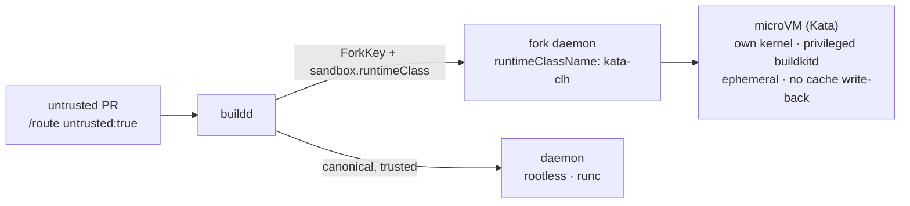

# Sandboxed (VM-isolated) untrusted builds

A build daemon runs attacker-controlled code in every `RUN` step. For **trusted** branches that is
acceptable behind rootless buildkit + a network lockdown. For **untrusted** code (fork / external PRs)
a shared kernel is a real escape surface. buildkit-operator can run untrusted *fork* daemons inside a
disposable **microVM** so a breakout is confined to a throw-away VM, not the node.

This is opt-in and applies to **fork daemons only** — trusted/canonical daemons keep running rootless
under the default runtime (runc) for full speed.



## How the operator wires it

Set `sandbox.runtimeClass` in the chart. When it is set, a fork daemon
(`sandboxedFork = SandboxRuntimeClass != "" && IsForkKey`) is rendered as:

- `runtimeClassName: <the class>` — pins it to the sandbox runtime (and, via the RuntimeClass
  `scheduling.nodeSelector`, to the nodes that provide it);
- the **non-rootless** buildkit image, **`privileged`** — the VM is the security boundary, so there is
  no need for the rootless dance, and rootless's setuid `newuidmap` cannot run inside a Kata guest
  anyway. Image defaults to `buildkit.image` with the `-rootless` suffix stripped; override with
  `sandbox.buildkitImage`;
- **without the companion** sidecar — fork daemons are ephemeral and disposable, so the inode-GC
  backstop is unnecessary and keeps the microVM lean.

Trusted/canonical daemons are unchanged (rootless + runc). The untrusted-fork isolation already in
place — ephemeral daemon, read-only snapshot seed, no cache write-back, optional internet-less egress
(`networkPolicy.forkEgressStrict`) — stacks on top of the VM boundary.

## Choosing a runtime

| Runtime | Isolation | Verdict for buildkit |
|---|---|---|
| **Sysbox** | user namespaces, keeps `no_new_privs` ON | ❌ the CE installer refuses recent Kubernetes (e.g. v1.31, "EOL") and is effectively unmaintained |
| **gVisor** (runsc) | user-space kernel | ❌ breaks buildkit's nested executor (runc + overlayfs inside the sandbox) |
| **Kata Containers** | real microVM (own kernel) | ✅ the VM hosts a normal kernel, so buildkit's nested `RUN` execution works; run buildkit **privileged** inside |

**Kata is the answer**, with two non-obvious requirements (see below).

## Kata requirements

- **Use cloud-hypervisor (`kata-clh`), not `kata-qemu`.** Under *nested* virtualization qemu boots too
  slowly; the kata-agent misses containerd's CRI `get state` deadline (`context deadline exceeded`) and
  the kubelet kills the sandbox. cloud-hypervisor boots fast enough.
- **Give the guest ≥ 4 vCPUs.** With the default 1 vCPU the agent is still too slow to answer the CRI
  status query under nested virt and the VM is killed / restart-loops. Set `default_vcpus = 4` in the
  kata-clh config. Kata reads its config **per-sandbox**, so no containerd restart is needed.
- Nodes must expose **nested virtualization** (`/dev/kvm`, CPU `vmx`/`svm`, `kvm_*` `nested=Y`).

Setup (kata-deploy values, the vCPU-tuning DaemonSet, and the full recipe) lives in
[../deploy/kata/](../deploy/kata/). Then enable it in the operator:

```yaml
sandbox:
  runtimeClass: kata-clh
```

!!! warning "Installing Kata modifies the node (containerd restart)"
    `kata-deploy` is not a passive add-on: on each targeted node it installs the Kata binaries to
    `/opt/kata` (hostPath) and **reconfigures + RESTARTS containerd** to register the kata runtime
    handlers. A containerd restart does **not** kill running containers, but the node's CRI
    control-plane blips for a few seconds — schedule a **maintenance window**, and keep it scoped to
    the **dedicated build nodepool** (never shared nodes that host other teams' workloads). The
    `kata-clh-vcpu-tune` DaemonSet, by contrast, does **not** restart containerd (Kata reads its config
    per-sandbox). This is the same node-level footprint Sysbox would have required — the difference is
    Kata confines it to a dedicated pool and a dedicated namespace.

The Kata plumbing runs in its own **`buildkit-system`** namespace (privileged + hostPath), which must
be added to the platform's `disallow-host-path` Kyverno exemption — unlike `kube-system` it is not
exempt by default. This is deliberate (least privilege / clean ownership); see
[deploy/kata/README.md](../deploy/kata/README.md) and
[ADR 0006](adr/0006-namespace-topology.md).

## Operational notes

- **Cold start** is slower than runc (VM boot + first image pull), and on a *busy* shared node the
  first start may take a couple of restarts before it settles — fine for untrusted PR builds, which
  are not latency-critical.
- **Churn**: many microVMs created/restarting at once can cascade into a feedback loop of kills on a
  busy node. The operator's `maxColdStarts` backpressure (default 8) caps concurrent cold starts and
  contains this. A node dedicated to builds (few other containers) gives the cleanest behaviour.
- **The VM runs the build as root** — that is safe precisely because the VM, not the container, is the
  boundary.

Platform-specific findings (OVH Managed Kubernetes) are in [platform-ovh-mks.md](platform-ovh-mks.md).
See also [security.md](security.md) for where this sits in the overall threat model.
