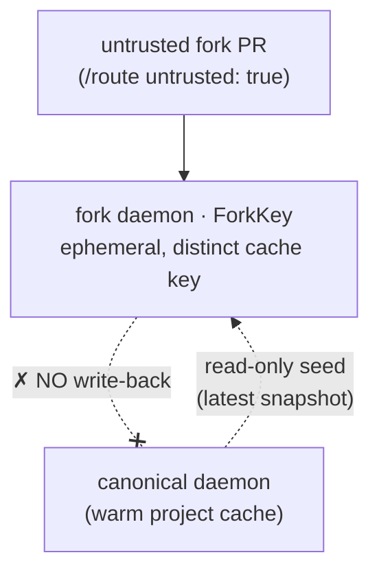

# Security model

This documents the security posture of buildkit-operator, the **one hard constraint** rootless BuildKit
imposes (and why it is not negotiable), the **admission-policy friction** on a hardened platform and
its fix, and the threat-model improvements buildkit-operator makes over a single shared daemon.

## The incompressible constraint: rootless `buildkitd` needs `no_new_privs` OFF

Rootless `buildkitd` sets up a user namespace with `newuidmap`/`newgidmap` (setuid helpers from
`shadow-utils`). Those helpers **must be able to gain the capabilities encoded in their file caps**,
which the kernel blocks when `no_new_privs` is set. Kubernetes sets `no_new_privs` whenever
`allowPrivilegeEscalation: false`. Therefore a rootless daemon requires:

```yaml
securityContext:
  runAsNonRoot: true
  runAsUser: 1000                 # NON-root
  allowPrivilegeEscalation:       # UNSET  (not false) — setting it false breaks newuidmap
  seccompProfile: { type: Unconfined }
  appArmorProfile: { type: Unconfined }   # without this: "failed to share mount point: permission denied"
```

Symptoms when this is wrong:

- `allowPrivilegeEscalation: false` ⇒ `newuidmap: Could not set caps` ⇒ crash-loop.
- missing `appArmorProfile: Unconfined` ⇒ `failed to share mount point: permission denied`.

**This is a property of rootless BuildKit, not of buildkit-operator.** Any rootless buildkit on Kubernetes —
including the existing `buildkit-service` — runs with exactly this posture. The pods remain
**non-root and unprivileged**; the only thing relaxed is `no_new_privs` (plus the default seccomp/
AppArmor filters, which the rootless engine manages itself). The alternatives are heavier, not
lighter: `securityProfile: userns` (host userns config) or `privileged` (a real privilege increase).

## Admission policy (Kyverno / restricted PSS)

The fabrique OVH platform ships a Kyverno `ClusterPolicy` (`add-custom-mas-securitycontext`) that
**mutates every pod** to `allowPrivilegeEscalation: false`. That silently breaks rootless buildkit
(see above). Two ways out:

1. **Exempt the daemon namespace** from the mutate rule — the precedented pattern on this platform
   (the `arc-runners` CI namespace is already exempted for the same reason). This is the recommended
   fix: the exemption is scoped to a dedicated build namespace, and the pods are still non-root.
2. Switch `securityProfile` to `userns`/`privileged` (worse — a genuine privilege increase).

> Operational note: apply the exemption **through GitOps** — add the namespace to the policy's
> exclude list, not via a live `kubectl edit` (an undocumented live edit is config drift). See
> [operations.md](operations.md#kyverno-exemption).

The buildkit-operator memory captures this as a reusable platform fact: *Kyverno blocks rootless buildkit;
exempt the daemon namespace (precedent: arc-runners).*

## The control plane is locked down

The friction above is **only** the build daemon. `buildd` itself is an ordinary controller and runs
fully restricted (from the Helm chart):

```yaml
securityContext:
  runAsNonRoot: true
  runAsUser: 65532
  allowPrivilegeEscalation: false
  readOnlyRootFilesystem: true
  seccompProfile: { type: RuntimeDefault }
  capabilities: { drop: [ALL] }
```

It mounts only the OIDC policy ConfigMap (when configured) and otherwise hands ConfigMap/Secret
**names** to the daemon pods it renders. RBAC is scoped to its own CRDs plus the
StatefulSet/Service/PVC/VolumeSnapshot/Lease verbs it actually uses.

## Project identity is server-verified (OIDC)

The cache identity of a build is its `repo` (and whether it is `untrusted`). If `/route` simply trusted
those fields from the request body, any caller holding the `/route` credential could **claim another
project's repo**, route to its canonical daemon, read/poison its warm + S3 cache, and run code where the
shared S3 credentials live. A single global bearer token makes that a one-secret compromise.

buildd closes this by binding identity to a **forge-signed OIDC token** (secure default, configured via
`oidc.providers`). GitHub Actions and GitLab CI both mint these natively — the token is already in the
job's environment, so there is **no extra runner egress**. On `/route` and `/prewarm` buildd:

1. **verifies** the JWT signature against the issuer's JWKS (cached), plus audience + expiry;
2. **overwrites** the request's `repo` with the verified claim (GitHub `repository`, GitLab
   `project_path`, host-qualified + normalized to the *same* cache key as before) — the client can no
   longer self-declare it, so a build can only ever reach **its own** project's daemon;
3. **derives `untrusted`** server-side (a PR / unprotected-ref build is forced untrusted — it can only
   ever *add* isolation, never drop it);
4. optionally enforces a **repo allowlist** (`oidc.repoAllowlist`) — a verified-but-unlisted repo gets
   `403`, a hard org gate on who may use the service at all.

Adding a forge (e.g. **Forgejo**) is adding one `oidc.providers` entry — the verifier is provider-keyed.

**Break-glass.** A distinct admin credential (`oidc.adminTokenSecret`, sent in the
`X-Buildkit-Operator-Admin-Token` header) bypasses OIDC and trusts the request as-is — for the manual
`build` CLI and in-cluster ops, held only by operators who already control the buildd Deployment (they
need elevated rights to run Kata anyway). Disabling verification entirely is an explicit, audited
`oidc.disable` (admin-only, since it reopens the self-declared-repo trust). When `oidc.providers` is
empty, OIDC is off and `/route` falls back to the legacy bearer (`auth.tokenSecret`) or open in-cluster
use — keep that only for fully in-cluster deployments.

## Where buildkit-operator is actually *more* secure than a shared daemon

Fork-PR isolation in one picture — an untrusted build is seeded read-only from the project snapshot
and can never write back:



The daemon posture is identical to a shared service; the improvement is in **blast radius and
isolation**, which a single shared `buildkitd` cannot offer:

| Risk on a shared daemon | buildkit-operator |
|---|---|
| **Cross-project cache poisoning** — any project's build can write cache that another project reads. | Each `(project, arch)` gets its **own daemon and its own PVC**, and `/route` binds the project identity to a **verified OIDC claim** (see above) — a caller cannot route to another project's daemon even with a valid credential. There is no shared writable cache to poison across projects. |
| **Untrusted fork PRs** run with the same cache-write access as trusted builds. | `untrusted: true` routes to a `ForkKey` daemon: **ephemeral, seeded read-only from the project snapshot, with no write-back**. A malicious fork cannot poison the project's warm cache. The fork spec comes from the shared `DeriveChild(parent, snapshot, ForkChild, key)` policy — the *same* derivation the fan-out uses (`CloneChild`), so isolation behaviour can't silently diverge between the two paths. |
| **Untrusted forks share the daemons' full internet egress.** | Two layers, applied to fork daemons *only* (canonical builds keep full speed): (1) `networkPolicy.forkEgressStrict` (**default on**) gives forks an **internet-less** egress — DNS (restricted to the `kube-dns` pods, not every namespace) + the explicit allowlist only, so base images come **only** through the in-cluster pull-through mirror and the build cannot exfiltrate to arbitrary hosts; (2) `sandbox.runtimeClass` runs forks under a **sandboxed runtime** (Sysbox/gVisor/Kata). Both target untrusted pods via the `untrusted=true` label the operator stamps on fork daemons. |
| **Noisy-neighbour / contention** — one heavy build starves others sharing the daemon. | Dedicated daemon per project; no sharing of CPU/store with unrelated builds. |
| **mTLS endpoint is a single shared trust domain.** | Per-daemon Service; the daemon cert can be scoped, and fork daemons are separate endpoints. |

## Honest tradeoffs

- **Same daemon hardening ceiling for *trusted* builds.** buildkit-operator does **not** make the trusted
  buildkit daemon more locked down than the shared service — both must relax `no_new_privs`. For
  *untrusted* builds it can do better: `sandbox.runtimeClass` runs fork daemons inside a disposable
  **microVM** (Kata), where the VM — not the shared kernel — is the boundary. This needs the runtime on
  the build nodes (a node-pool concern), but the per-fork wiring is built in rather than orthogonal. See
  [sandboxed-builds.md](sandboxed-builds.md) (why Kata over Sysbox/gVisor, and the cloud-hypervisor +
  ≥4-vCPU requirements under nested virt).
- **Public exposure is two authenticated LBs.** Off-cluster CI reaches every daemon through a
  **single** SNI gateway LoadBalancer (not one LB per daemon); daemons stay `ClusterIP` and mTLS is
  end-to-end (the gateway terminates no TLS), so a valid **client cert** is required to build. The
  gateway caps pre-auth connections (`gateway.maxConns`) so an unauthenticated flood can't exhaust it.
  The separate `/route` API is **identity-verified** (OIDC, above), with the legacy bearer / admin token
  as the in-cluster fallback. Prefer the **TLS Ingress** for public `/route` access — the raw L4
  `service.type: LoadBalancer` serves plain HTTP, so the chart refuses it unless you set **both**
  `service.loadBalancerSourceRanges` (an IP allowlist) **and** `auth.tokenSecret`. External surface is
  fixed and small regardless of project count; keep both off (in-cluster runners only) when you don't
  need internet-facing builds.
- **Retained cache PVCs are GC'd when their project disappears.** A project's cache PVC is retained
  across scale-to-zero (so the warm cache survives), which means it is *not* owner-ref-collected when its
  BuildProject is deleted. A leader-only sweeper reclaims any cache PVC with no live BuildProject (fork
  PVCs also auto-delete via the StatefulSet retention policy), so an externally-deleted project or a
  crash mid-reap can't leak storage.
- **The live exemption is platform state.** The Kyverno exemption must be tracked in GitOps; an
  undocumented live edit is config drift.
- **S3 cold-cache credentials live on the daemon as env vars.** When `s3.credsSecret` is set, the AWS
  key/secret are injected as `AWS_ACCESS_KEY_ID`/`AWS_SECRET_ACCESS_KEY` on the buildkitd container (so
  CI callers never carry them — see [storage-and-cold-cache.md](storage-and-cold-cache.md)). Any build
  step that runs *inside that daemon* can read `/proc/1/environ` and exfiltrate them. For **trusted**
  projects this is acceptable (the daemon is single-tenant). For **untrusted fork PRs** it is **not**:
  do not point fork daemons at a writable/shared S3 bucket, and run them under `sandbox.runtimeClass`
  (Kata), where the microVM hides the host's `/proc` and isolates the credentials. The fork-isolation
  default (read-only seed, no write-back) already prevents cache poisoning; this note is specifically
  about credential exposure when the cold cache is enabled.

See [comparison-buildkit-service.md](comparison-buildkit-service.md) for the full side-by-side.
